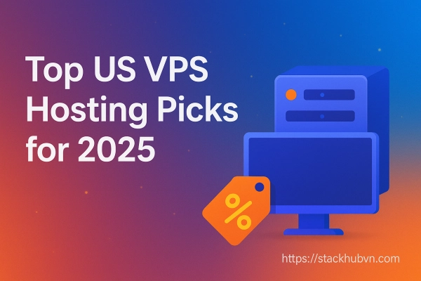

# 2025年美国VPS主机推荐：速度快、线路优、支持支付宝

如果你正在找一台连接国内速度快的美国VPS，却被各种线路名词搞得头晕——什么CN2 GIA、AS9929、CMIN2——别担心，这篇文章就是给像你我这样的普通用户看的。我们不谈那些复杂的技术细节，只说哪些VPS用起来快、稳定，而且能用支付宝付款。说白了，就是帮你找到真正好用的美国VPS。

---

## 1. V.PS – 三网高端线路，不怕晚高峰

V.PS是XTom旗下的云服务器品牌，机房遍布美国、香港、日本、新加坡等地。

**圣何塞机房最值得关注**，因为它采用了三网高端线路：
- 电信走CN2 GIA（AS4809）
- 联通走CUII（AS9929）
- 移动走CMIN2（AS58807）

这意味着什么？晚上八九点钟大家都在刷视频的时候，你的VPS速度也不会慢下来。这种稳定性对于需要长期运行项目的人来说特别重要。

西雅图和纽约的机房用的是标准国际线路，适合面向全球用户的业务，但对国内访问的优化就没那么明显了。

如果你需要一台稳定的国际VPS，又希望国内访问速度不拖后腿，V.PS是个靠谱的选择。想了解更多配置和价格？👉 [查看三网高端线路如何保证你的VPS始终高速在线](https://bandwagonhost.com/aff.php?aff=79616)

## 2. BandwagonHost – 10Gbps带宽的CN2 GIA专家

BandwagonHost，也就是大家常说的"搬瓦工"，是一家2004年成立的加拿大主机商。他们专注做一件事：提供高端线路的VPS。

所有美国VPS套餐都强制使用CN2 GIA三网线路，带宽从2.5Gbps到10Gbps不等。这在业内算是比较少见的——很多商家只在入门套餐用普通线路，高级套餐才给好线路。但搬瓦工不一样，他们的理念就是"要做就做好的"。

除了美国机房，他们还有：
- 香港CN2 GIA（1Gbps）
- 新加坡CN2 GIA（1Gbps）
- 日本CN2 GIA（1.2Gbps）
- 日本软银（10Gbps）

控制面板功能也很实用：一键换IP、快照备份、多机房切换。支付方式也齐全：PayPal、支付宝、信用卡、甚至加密货币都行。

搬瓦工在CN2 GIA VPS领域的口碑一直很好，如果你不想折腾，直接选他们准没错。

## 3. RakSmart – 圣何塞自营机房，流量不限

RakSmart是2012年成立的美国主机商，在圣何塞有自己的机房。这点很重要——自营机房意味着他们对硬件和网络有完全控制权，出问题能更快解决。

**美国VPS的亮点：**
- 多种线路选择：优化大陆线路、VIP线路（AS4837）、纯CN2、纯AS9929
- 带宽高达5Gbps，独享，流量不限
- 支持Linux和Windows Server（2003-2019各版本）

硬件配置也很夸张：
- 最高256GB内存、48核CPU、253个IP地址
- 系统盘（40GB免费）和数据盘分离
- 免费快照和备份

除了美国，他们在香港、日本、韩国也有机房。公司有20多年行业经验，提供中英双语客服，不需要实名认证，支持加密货币、信用卡、PayPal和支付宝付款。

RakSmart适合那些需要大流量、高配置的用户。如果你要跑数据密集型业务，或者需要Windows系统，可以重点考虑。

## 4. ZgoVPS – 三网全高端，原生IP

ZgoVPS的特色是硬件配置高。他们用的是最新的AMD EPYC、Ryzen和Intel CPU，配DDR5内存和三星数据中心级NVMe SSD阵列。单核跑分能到2000，这个性能放在VPS里算是很强了。

**美国机房连接：**
- 电信CN2 GIA
- 联通CUII
- 移动CMIN2

而且提供原生IP——这对某些特定用途（比如注册某些只允许本地IP的服务）很重要。

**价格：**
- 三网高端VPS从4美元/月起
- 国际线路VPS从12美元/年起

支持PayPal和支付宝付款。如果你在意性能，预算又不算太紧，ZgoVPS值得一试。

## 5. Lightlayer – 三网CMIN2/直连/国际线路可选

Lightlayer专注VPS和独立服务器租赁。他们的特点是灵活——你可以自定义CPU、内存、存储、带宽、IP数量、快照等各项配置。

**美国VPS网络选项：**
- 高端CMIN2线路（强制三网）
- 标准直连线路
- 国际线路

所有套餐都是无限流量，支持Linux和Windows系统。除了美国，他们在台湾和新加坡也有优化线路的VPS。

支付方式支持PayPal。Lightlayer适合那些有明确需求、希望按需定制配置的用户。

## 6. Vmiss – 洛杉矶三网高端，1Gbps带宽

Vmiss是由加拿大华人运营的VPS服务商，专注KVM架构VPS。机房位于美国、香港、日本。

**洛杉矶VPS特点：**
- 连接电信CN2 GIA、联通CUII、移动CMIN2
- 最高1Gbps带宽
- 企业级连接，晚高峰时段也稳定

Vmiss的价格相对亲民，适合个人用户和小型项目。如果你预算有限，又想要三网高端线路，可以看看他们家。

## 7. EdgeNat – 美国三网AS4837，原生IP

EdgeNat提供美国三网AS4837线路VPS，带原生IP。AS4837是联通的骨干网，对联通用户特别友好。如果你或你的目标用户主要用联通网络，EdgeNat是个不错的选择。

他们定期有促销活动，比如云服务器7折优惠，最低23元/月起。想追求性价比的话，可以留意他们的促销信息。

## 8. OneTechCloud – 多线路选择，原生IP/双ISP IP

OneTechCloud提供多种线路选择：
- 美国CN2 GIA
- 美国CUII
- 美国AS4837

还提供原生IP和双ISP IP。双ISP IP的好处是可以同时优化多个运营商的访问速度。

香港机房用CN2和CMI线路，美国机房用CN2和AS4837，价格从22元/月起。对于需要多地机房、多线路组合的用户来说，OneTechCloud提供了比较灵活的方案。

## 9. Lisahost – 双ISP住宅IP，多线路可选

Lisahost的亮点是提供双ISP住宅IP。住宅IP和普通数据中心IP的区别在于，它看起来像真实家庭用户的IP，在某些场景下（比如社交媒体营销、数据采集）更不容易被识别和限制。

**美国VPS网络选项：**
- 双ISP住宅IP
- CUII线路
- AS4837线路
- CN2 GIA网络

如果你需要住宅IP，或者想测试不同线路在你的业务场景下的表现，Lisahost是个值得关注的选项。

---

## 总结：选VPS其实没那么复杂

看了这么多选择，你可能会问：到底该选哪个？

其实很简单。问自己几个问题：

1. **预算多少？** 预算充足选BandwagonHost或V.PS，预算有限选Vmiss或EdgeNat。
2. **主要用途是什么？** 建站选稳定的三网高端线路，跑项目选高配置的ZgoVPS或RakSmart。
3. **网络环境如何？** 电信用户优先CN2 GIA，联通用户可以考虑AS4837，移动用户选CMIN2。

不要被那些技术术语吓住。线路名称听起来复杂，但本质就是"哪条路更快更稳定"。👉 [了解为什么搬瓦工的三网高端线路能让你的VPS在任何时段都保持高速](https://bandwagonhost.com/aff.php?aff=79616)

选VPS就像选餐厅——口碑好、价格合理、服务靠谱，这三点满足了就差不多了。别想太多，选一个试试，不合适再换。毕竟VPS又不是买房子,试错成本没那么高。
